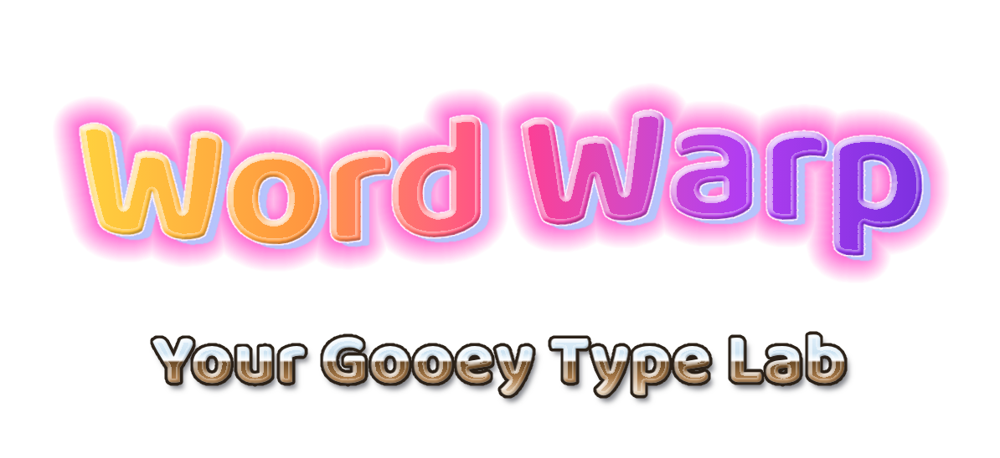
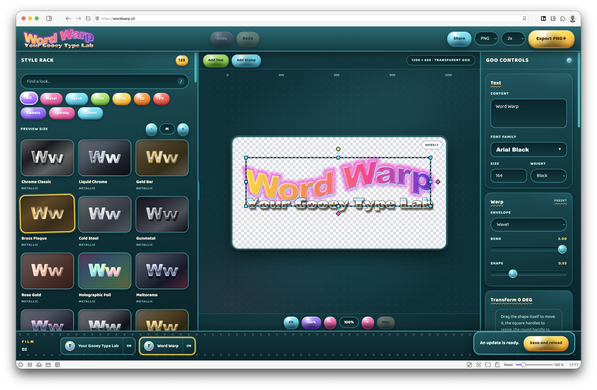

> [!IMPORTANT]
> LLM disclosure: This codebase was written with substantial help from large language models: AI coding agents working from the [`AGENTS.md`](AGENTS.md) brief in this repo.

**Latest release:** v<!-- version -->0.1.0<!-- /version --> · [Download](https://github.com/L-K-M/WordWarp/releases/latest)

WordWarp is a browser-based studio for warped, metallic, dimensional text with alpha-correct image
export. The product and rendering decisions are documented in [`PLAN.md`](./PLAN.md).

WordWarp's original code and artwork use the [Unlicense](LICENSE), with explicit
[third-party exclusions](LICENSING.md). Fonts, libraries and platform components
retain their own licenses; see [third-party attribution](THIRD_PARTY.md).

Native macOS, Android and Ubuntu builds provide platform-native layer, typography,
warp, effect and animation controls, editable document files, and PNG/APNG/GIF export.
The desktop apps use a Layers/Styles sidebar, Select/Pan tool strip and contextual
Object/Effects/Motion/Canvas inspectors. The web editor shares their semantic controls
and compact effect/animation headers. See [native build instructions](./native/README.md).


[

](https://wordwarp.ch/#ww=1.5VjZbuTGFf0Vgc_NTq1kVb8lBmI_TJAAHmfiBHkoksVWjShWh2RLowj6d59L9kK2Fo-NMWzDWlnbrXvP3Q77MbnzXR9im2zkKglVskmqujCa8TwtpKlS5V2ZFtzWaeVNzjUTzuUsWSWtu_XY_V07hKHx1dW963aYLl175_pk85jch2q4TjZcMLZKrn3YXg_JJpMYFK682XZx3-K6dt80q8Tth_jXgPWh2_tV4j_tYjf8w1VVaLfJRpknzDX-1rcDRP_ncVK09KaymsnU-6JIVaUrqFxlqfB1Zb10rMjcWdEPsauuPkxK3oU-FA1mp-uaWN54SKxd02MYd64MwwNUh6qNb6u_xYoktLG7dQ2OD51r-xojMvNTstFWrWWuM6604YrzfJXgtNBibYxVQjJmjLLarJIuDm4Y0QYMfeka_y9cs-a5towxqbTAdpsd1r6nNWYya2xmmeCKSSmwduPvcYwk4Amb8BS7sA0tza71cUQra03Q1bUv58h5bupClSqVxtdwMStTw61Ks0JZWTInKl7CTt862I8DE0wnXNgapsyRud03Q9g1DzjTNxFuHF1M0RCb2OFetsIZa5i0guvMZCJXesVX_L9wfbslTyBMVkkV-sG15TiEqPB_PMGcMrZD3B_lCI0_9JtDBAS0MfTYh-M3gSIqqbq4-_baVfGe9Nl13mGWAchVsu_9100sXPNuCsfJsJsWARD3h_HT6oCS09KziulUc2tSlXmTulxwDHOnTW5M7tWbKEHBBUx92XnfPgNp50KL4eNR_z42uP8MHl-N8Ekuc6GVZdxmLLewHa49Gz_48roN_9uPF8V68B1dNEIoYPnbGCKgtyRmVPljGOj0DFFg4zsAdwnoCarKljmzXKSFEiJVOQVUVZdppksnbVkXsn4roF5LtCNOsaLQOihTh4bWLlHbdq4KKBBYOj1idXjYkcgmtN6NiAxxN2VCrOveYw_MnCG9NmoBtAH4hPRs_1pefC0FqMs4x4GF64x6JjG7-FpKpCNzEeS7PAPK2hghtbCKUmkuEYCeUm-tDrceReA4P2oymzNzpZk1JPKcn5ZgAqYUGJA5xg9Wxzo13leF4ZoWJ9fCN77bxeZQ7ZJ407gieXo6RYxVZe15ibwS0iFinEudQEVimfVe5qpk6q3k-kkRU_g7Py4OD6QslGvH7FikzG2MaFeww-_GtkWNqgodCudkwZ4ax5RPqO9jhmEaeswLmEMdHPakkkQivVxttk3s-6_eTMdr7G-mM4-zSBi_sfxiTZlXZxSGfiqAs_OII0nBpOgPeffVGj4TlemnKQjC7ehKSh2MD1k1-E-Ub-O_ZYetYR9dXrvbAJmb5M9dcM3VX5qp5PWwnco8td7Rb_cHfoA2iOAZXBPKUz-uvRv2nR9JBVBxp7LtO3hgLNkwuHEPYwl_PDiJZ4r8EbbkvEPkYhfqwDeHu-C7xlOp-5bsJaKRAhkNx93DktMk1dZzw0eotZ7CZBYazUCiy31350-nEteVKeDdIpig3ciOzsUKNZTyFFVsepig_ODuPMekqz5OSUb-oiwr4CaU8alBghl9M2p1GPxzqtTe777boe-TZSNw51yrRM5lgeqcCY1cs4VMwSgkho5LXWvBpDkTpe_hm6uvY_QPV-_h5qt3SNxfgDKZdZaDMOUWiCsUMKJMMjdrloGJEN3JtHqVMc0I0pfgQ0YqwzTqkChKal-VT50tXMprVZbWeGhLGLze6VGwfxofgpmHMnvoFVSB2WLGZGO6XnSTzyNNfGxqvwprqpmxRQEEs0ygutd4czBS2FS63Iha-aqsxe-ACqCKXngD2Nmx1_JT7x3r8bKT81nvBuCLJssE4X_pT4i95BOXQhUcexZqz0RilEwSngXJcxl2Tipe2qEXt8jnqotlyI6QzNB4kYkgNxZiERVzITkRpvlxEkdXzcc5y55JzUdOe4LkIk0I56VahLNeTsF9r5MmuyRDo5suvY8YubRmwZm4-cKkqS5Yrh3jaV5UeOOttUpdXRdprqURRYEa9iuTJv06aUL4_ZFI09FluUK0OI8PUniRg-zipcjkok7rSqkKUwgd-_NdVnfEs04-64cu3hA7OXz2gszbxT4cw2k_9AFifvyNk14Qnr_FsIuXFMpd9uKrTfIxBrpx-oxnldwGBPa7gH_4MAcR4nooN33yQ89_P2b1Z1PNlznKM9L51TXiLM75ZgGFCOcz41RfjHFStv9WCedByIlZLojlmUt-JrEkN_VwGQGEu5Cc53x9fDW3sfPWDwAT6QV6MVC4JwJEL2UGP--53fB8I-3acvZvippYhTosd9n3XG0kR6Whmk-73A52ju8e9OrxJ4TumqFm_gA)

## Development

WordWarp uses Node.js 22.23.2 and npm 10.9.8. Version managers can read `.nvmrc`; CI reads the same
file. Install exactly what `package-lock.json` declares:

```bash
npm ci
./node_modules/.bin/playwright install chromium webkit
npm run dev
```

The complete local gate is:

```bash
scripts/check.sh
```

On a new machine, `scripts/check.sh --install-browsers` also downloads the Playwright browsers.
Linux CI uses Playwright's `--with-deps` mode to install required system packages. Individual checks
remain available as `npm run lint`, `npm run typecheck`, `npm test`, `npm run build`,
`npm run test:e2e`, and `npm run test:native`. The complete gate includes the native
canvas bridge in Chromium and WebKit; actual native host tests run separately.

`scripts/build.sh` performs a clean locked install and creates a portable static site under `dist/`.
Serve that directory over HTTPS (or localhost); service workers and installable PWA behavior do not
work from `file://` URLs.

Native packaging commands are `npm run build:macos`, `npm run build:android`,
`npm run build:linux`, and `npm run build:flatpak`. They create Mac app archives,
an Android debug APK, an Ubuntu 24.04 `.deb`, and a GNOME-runtime `.flatpak`
bundle under `artifacts/native/` (`scripts/build-linux.sh --flatpak` builds both
Linux packages in one go). Each platform has its own SDK/runtime
requirements, described in the native build instructions. CI builds all
targets, including Apple silicon and Intel Mac variants, with downloadable checksums.

## Deployment

### Docker

Build and run the production PWA with Docker Compose:

```bash
docker compose up --build
```

Open `http://localhost:8080`. Set `WORDWARP_PORT` to use another host port:

```bash
WORDWARP_PORT=3000 docker compose up --build
```

The service binds to `127.0.0.1` by default. Set `WORDWARP_HOST=0.0.0.0` to expose it on the network,
and put it behind HTTPS anywhere other than localhost. Stop it with `docker compose down`.

On a deployment host, update the current branch and rebuild the service in one step:

```bash
./update.sh
./update.sh main # explicitly select a branch
```

The updater refuses tracked local edits, fast-forwards from `origin`, refreshes base images, builds
before replacing the running container, and waits for the Compose health check.

Tagged releases publish the immutable `ghcr.io/l-k-m/wordwarp:<version>` tag for `linux/amd64` and `linux/arm64`.
The first GHCR package may be private until its package visibility is changed.

### GitHub Pages

`pages.yml` builds WordWarp for `/WordWarp/` and deploys only a successfully tested `main` commit.
Deployment is opt-in through the repository variable `WORDWARP_PAGES_ENABLED=true`.
To enable it, configure Pages with GitHub Actions as its source and set the variable to true.

## Releases

On macOS, install the shared [`lkm-release`](https://github.com/L-K-M/release-tool) tool, then run:

```bash
scripts/release.sh 0.2.0 --push
```

The helper updates `package.json`, `package-lock.json`, and this README marker together, commits the
bump, and creates `v0.2.0`. The tag workflow independently verifies the versions and `main` history,
re-runs CI, publishes a portable `.tar.gz` plus SHA-256 checksum, publishes the GHCR image, and
creates the GitHub Release. Do not create release tags by hand.

Native packages are currently downloadable CI artifacts, retained for 14 days;
the release workflow does not attach them to GitHub Releases. Mac builds are
ad-hoc signed and Android builds are debug signed. The separate
[native publication proposal](./native/RELEASE-PROPOSAL.md) describes a future
change that requires authorization.

The shared release engine currently requires BSD `sed`; the WordWarp wrapper refuses release mutation
on GNU/Linux before changing files. `scripts/release.sh --check` remains portable.

Application SemVer is independent from the serialized document version (`DOC_VERSION`) and IndexedDB
schema version. Only bump those storage versions when their schemas change, with migrations and tests.

See [`CICD.md`](./CICD.md) for workflow details and repository settings.

GIF transparency is one-bit and uses ordered dithering. APNG is the recommended animated format for
soft glows and shadows. Native system fonts use the browser raster path; exact outline-backed
`keepUpright` warping requires an imported TTF/OTF font. Large exports that require tiling reject
reflection effects rather than risk clipped or misaligned pixels.
